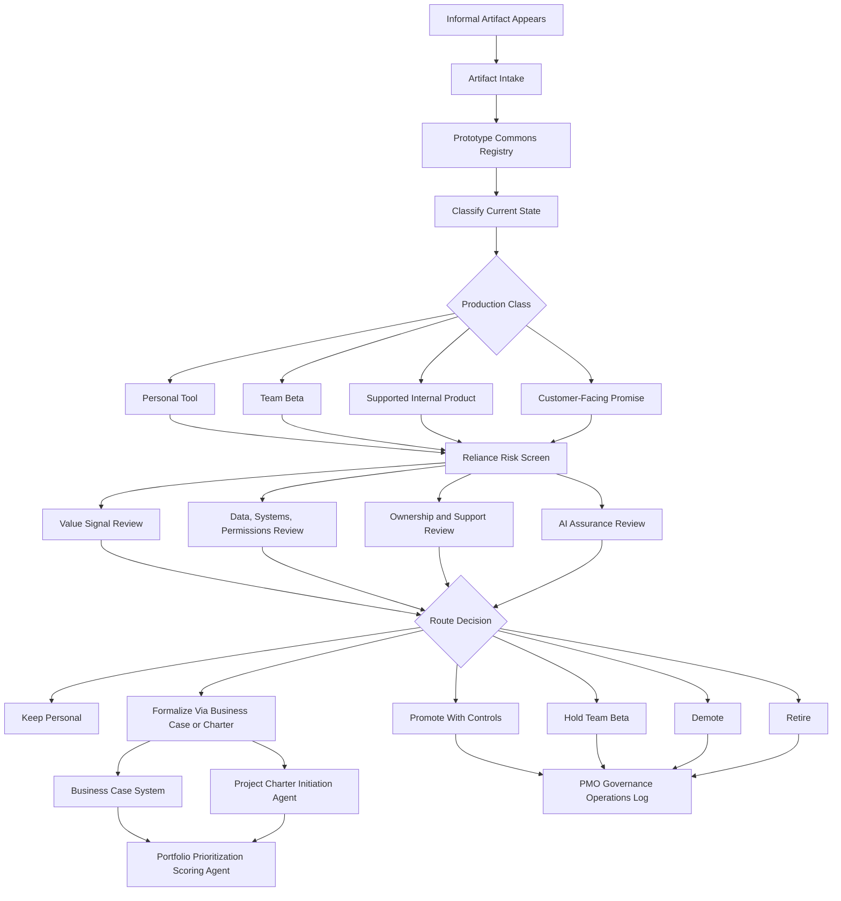

# AI Artifact Lifecycle Governance System

**A lightweight ChatGPT Project package for classifying, governing, promoting, demoting, or retiring AI tools and software artifacts that already exist before the business has formally approved them.**

This repository is part of a modular AI-native business enablement portfolio. It is designed for PMO, EPMO, product, platform, operations, and AI transformation leaders who need to manage the new operating space between **informal employee-built tools** and **formal business reliance**.

## What this package is

AI makes first versions cheap. Employees can now create scripts, dashboards, GPTs, agents, automations, lightweight apps, and workflow tools before a normal intake process ever sees them.

That creates a practical leadership problem:

> Something already exists. Should the business rely on it?

This system gives a human leader a structured way to answer that question without turning experimentation into bureaucracy. It captures informal artifacts, classifies their current maturity, screens value and risk, and routes each artifact to the right next step.

## What problem it solves

Without a lightweight artifact governance layer:

- useful prototypes stay hidden;
- risky tools spread without ownership;
- teams confuse demos with durable capability;
- local automations become quiet business dependencies;
- leaders cannot see which artifacts deserve support, funding, retirement, or escalation;
- governance arrives late, after the business is already relying on something fragile.

This package creates a practical middle layer: **default allow for experimentation, intentional promotion for business reliance, and explicit demotion or retirement for artifacts that should not become supported products.**

## Who this is for

- PMO, EPMO, and portfolio governance leaders
- Product and platform leaders managing internal AI/software abundance
- AI transformation and business operations leaders
- Chiefs of staff and executive operators
- Technology governance teams handling citizen development
- Internal product owners inheriting unofficial tools
- Leaders deciding what to promote, hold, formalize, demote, or retire

## What it does

- Captures informal AI/software artifacts through a lightweight intake record.
- Builds a prototype commons registry from scattered tools, automations, agents, dashboards, and workflows.
- Classifies artifacts using a production class ladder.
- Separates personal tools, team betas, supported internal products, and customer-facing promises.
- Screens reliance, data, systems, permissions, ownership, operational risk, value signal, and support exposure.
- Recommends a route: keep personal, hold as team beta, promote with controls, formalize through business case or charter, demote, or retire.
- Produces executive-ready outputs that feed the next module in a broader AI-native operating system.

## What it does not do

- It does not approve tools for production use.
- It does not replace security, privacy, legal, architecture, product, or executive review.
- It does not certify AI systems as safe.
- It does not invent value, usage, ROI, or risk data.
- It does not assume all prototypes should become products.
- It does not shut down experimentation by default.
- It does not duplicate business case, project charter, portfolio scoring, or governance-log work.

## Install and use in ChatGPT

Use the `chatgpt-project/` folder as the actual ChatGPT Project runtime.

### Step 1 — Create a new ChatGPT Project

Create a new ChatGPT Project with a name such as:

```text
AI Artifact Lifecycle Governance System
```

### Step 2 — Add the project instructions

Open `AGENTS.md` from this repository and paste its contents into the ChatGPT Project instructions field.

### Step 3 — Upload only the runtime files

Upload only the files inside:

```text
chatgpt-project/
```

Do **not** upload the full repository into ChatGPT. The full repository includes examples, templates, workflow diagrams, test results, quality review notes, and optional local tooling for GitHub/Codex review.

### Step 4 — Start with a working prompt

```text
Use this project to classify the attached AI/software artifacts, build a prototype commons registry, recommend production classes, identify reliance risk, and produce a routing pack for the next governance module.
```

### Step 5 — Provide artifact inputs

You can provide one artifact, a messy notes dump, a CSV inventory, meeting notes, screenshots translated into text, or a list of known internal tools. The system will ask only for missing information needed to classify and route the artifacts responsibly.

## Use with Codex or a local repo

Use the full repository when you want to inspect the package, revise files, run sample data, or generate local Markdown outputs.

Example local smoke test:

```bash
python tools/classify_artifacts.py \
  --input examples/sample-data/synthetic_artifacts.csv \
  --output examples/sample-outputs/generated_artifact_classification.md
```

The local script is intentionally simple. It is not the operating system; it is a lightweight demonstration tool for validating example data and producing sample Markdown output.

## GitHub layer vs. ChatGPT runtime layer

This repository has two shapes by design.

| Layer | Purpose | What to use |
|---|---|---|
| GitHub repository layer | Discovery, explanation, examples, sample data, templates, workflow diagrams, local tooling, and public portfolio review | Full repository |
| ChatGPT Project runtime layer | Actual operating files uploaded into a ChatGPT Project | `chatgpt-project/` only |

The runtime folder is flat, self-contained, and intentionally below the 25-file ChatGPT Project limit.

## How it fits the modular portfolio

This module fills the missing layer between informal artifact creation and formal portfolio intake.

| Lifecycle position | Core question | Adjacent module |
|---|---|---|
| AI opportunity review | What should exist? | `ai-opportunity-intelligence-review-system` |
| Artifact lifecycle governance | Something exists. Should we rely on it? | `ai-artifact-lifecycle-governance-system` |
| Business case | Is formal investment justified? | `business-case-system` |
| Project initiation | What are we authorizing? | `project-charter-initiation-agent` |
| Portfolio prioritization | What should be sequenced and funded? | `portfolio-prioritization-scoring-agent` |
| Governance operations | How do we track decisions, risks, actions, and follow-through? | `pmo-governance-operations-log` |

## Production class ladder

| Class | Meaning | Typical minimum standard |
|---|---|---|
| Personal Tool | One person uses it for personal productivity. | Owner known; no unsupported sensitive-data handling; no business dependency. |
| Team Beta | A small group uses it to test usefulness. | Owner and backup owner; short description; systems touched; usage signal; failure plan. |
| Supported Internal Product | The business relies on it internally. | Product owner; platform partner; access management; monitoring; documentation; support path; auditability; change process. |
| Customer-Facing Promise | It affects external users, customers, contractual commitments, or brand trust. | Full product standards plus AI-specific evals, release controls, governance, support, legal/privacy/security review where applicable. |

## Workflow



## Repository structure

```text
ai-artifact-lifecycle-governance-system/
  README.md
  AGENTS.md
  LICENSE.md
  .gitignore
  requirements-and-specifications.md
  outcome specifications.txt

  chatgpt-project/
    20 flat runtime files

  examples/
    README.md
    sample-data/
    sample-prompts/
    sample-outputs/

  templates/
  tools/
  workflow/
  quality-review/
  test-results/
```

## Runtime contents

The `chatgpt-project/` folder contains 20 flat files:

- runtime start guide
- operating model
- trigger map
- artifact intake record
- prototype commons registry
- production class ladder
- reliance risk screen
- value signal review
- data, systems, and permissions review
- AI assurance controls
- promotion and demotion decision rules
- route-to-next-module logic
- output templates
- working session prompts
- quality review rubric
- privacy and human-control rules
- glossary

## Primary outputs

- Prototype Commons Registry
- Artifact Classification Brief
- Reliance Risk Screen
- Promotion/Demotion Decision Brief
- Executive AI Artifact Review Pack
- Handoff Packet to Business Case, Charter, Portfolio Scoring, or Governance Log

## Examples and sample outputs

Sample prompts and outputs are included in the GitHub layer, not inside the ChatGPT runtime folder. This keeps the runtime lean while still making the repository understandable to visitors.

| File | Purpose |
|---|---|
| `examples/sample-data/synthetic_artifacts.csv` | Synthetic artifact inventory for testing |
| `examples/sample-prompts/sample_working_session_prompts.md` | Starter prompts for running the module |
| `examples/sample-outputs/prototype_commons_review_pack.md` | Sample executive review pack |
| `examples/sample-outputs/generated_artifact_classification.md` | Sample artifact classification output |
| `examples/sample-outputs/tool_generated_classification.md` | Local classifier smoke-test output |
| `test-results/package_test_results.md` | Package validation notes |

## Human-control statement

The system may recommend that an artifact appears ready to keep personal, hold as team beta, promote, formalize, demote, or retire. It must not approve production use, commit resources, accept risk, shut down a team tool, change access, contact owners, notify users, or alter any live system. Those remain human leadership decisions.

## Quality standard

A successful use of this package should produce clear judgment, not paperwork. The output should help a leader understand:

- what exists;
- who uses it;
- what it touches;
- whether anyone relies on it;
- whether it has value signal;
- what risks or ownership gaps exist;
- whether to keep it local, hold it as a beta, promote it, formalize it, demote it, or retire it;
- which next module should receive the handoff.

## License

Source code and scripts are licensed under MIT. Documentation, prompts, templates, examples, and other non-code materials are licensed under CC BY 4.0 with attribution to Marco Policani. See `LICENSE.md`.

## Search keywords

AI artifact governance, prototype commons, post-prototype governance, citizen development governance, production class ladder, AI governance, PMO, EPMO, portfolio governance, internal product ownership, AI operating model, AI transformation, business reliance, promotion demotion governance, AI tool registry, ChatGPT Project, Codex workflow package, executive AI portfolio review.
